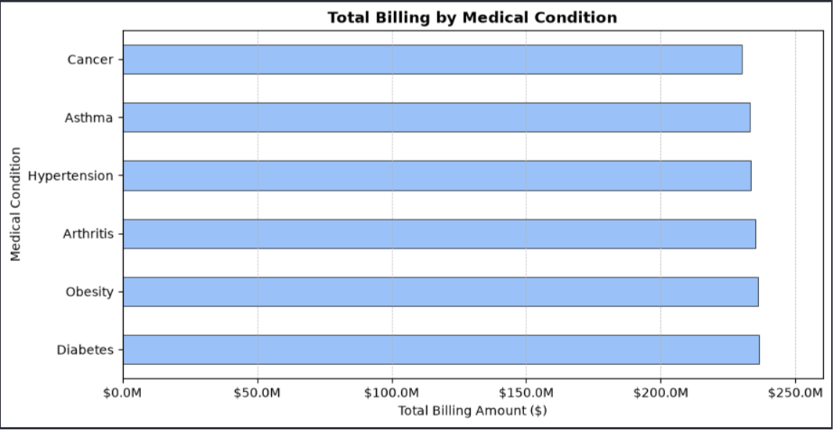
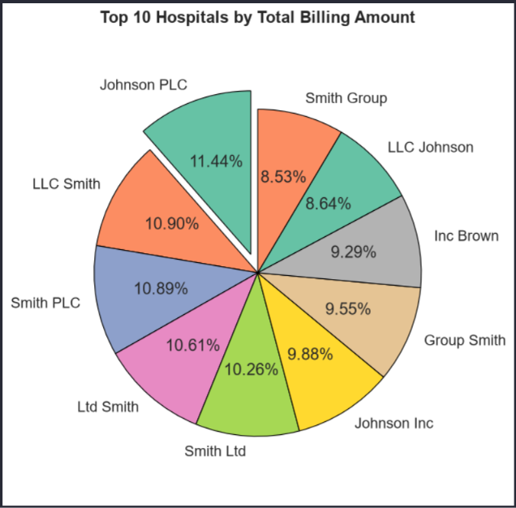
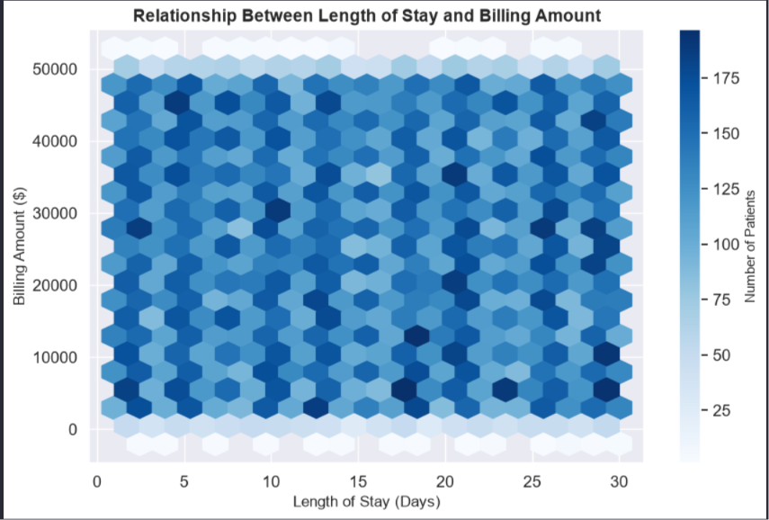
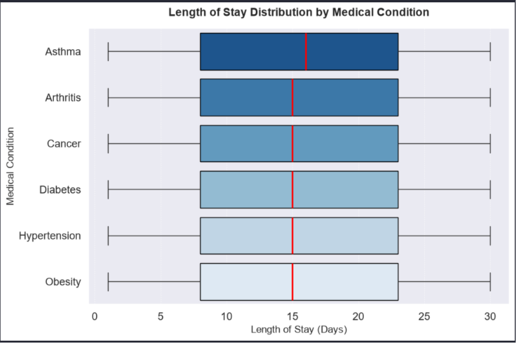
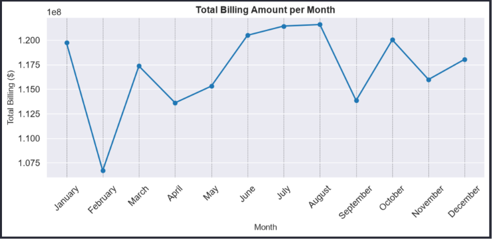
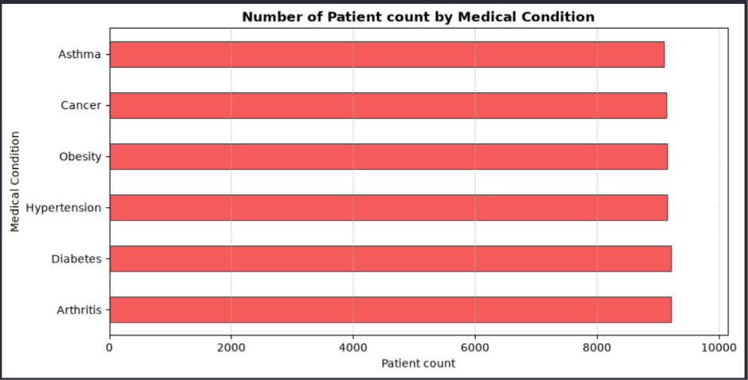
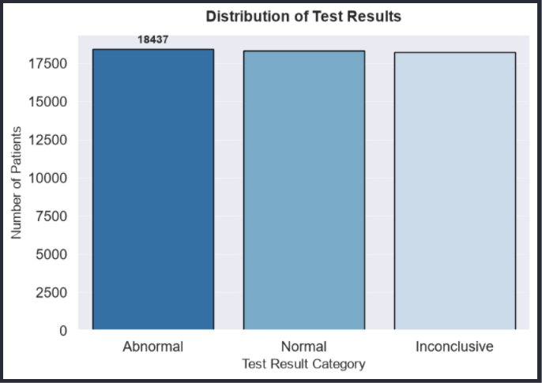
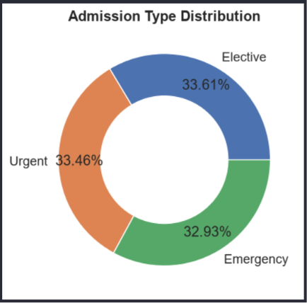

# 🏥 Healthcare Data Analysis

## 📌 Project Overview

This project performs Exploratory Data Analysis (EDA) on a healthcare dataset to uncover trends in patient demographics, medical conditions, hospital billing, and healthcare operations. The analysis demonstrates practical data analysis skills using Python and data visualization techniques.

---

## 🎯 Objectives

- Clean and prepare healthcare data
- Analyze patient demographics
- Examine medical condition distribution
- Explore hospital billing trends
- Identify admission patterns
- Analyze insurance provider performance
- Generate business insights through visualization

---

## 📂 Dataset

Healthcare Dataset containing patient records, hospital information, billing details, medical conditions, admission types, insurance providers, and test results.

---

## 🛠️ Technologies Used

- Python
- Pandas
- NumPy
- Matplotlib
- Seaborn
- Jupyter Notebook

---

## 📊 Analysis Performed

- Data Cleaning
- Missing Value Analysis
- Duplicate Removal
- Feature Engineering
- Statistical Summary
- Patient Distribution Analysis
- Billing Analysis
- Age Group Analysis
- Hospital Performance
- Insurance Provider Analysis
- Correlation Analysis
- Length of Stay Analysis
- Monthly Revenue Trends

---

## 📈 Visualizations

- Horizontal Bar Charts
- Line Charts
- Pie Charts
- Histograms
- Box Plots
- Count Plots
- Heatmap
- Hexbin Plot

---

## 🔍 Key Insights

- Medical conditions contribute differently to healthcare costs.
- Billing patterns vary across hospitals and insurance providers.
- Longer hospital stays are generally associated with higher billing amounts.
- Monthly billing trends reveal fluctuations in healthcare revenue.
- Patient demographics provide valuable operational insights.

---

## 🚀 Skills Demonstrated

- Data Cleaning
- Exploratory Data Analysis (EDA)
- Feature Engineering
- Data Visualization
- Business Insight Generation
- Statistical Analysis
- Python Programming

---

## 📷 Project Visualizations

### 💰 Total Billing by Medical Condition

### 🏥 Top Hospitals by Total Billing

### 🏨 Patient Length of Stay Distribution

### 🩺 Length of Stay by Medical Condition

### 📈 Monthly Billing Trend

### 👥 Patient Distribution by Medical Condition

### 🧪 Test Results Distribution

### 🚑 Admission Type Distribution

## ⭐ Future Improvements

- Interactive Power BI Dashboard
- Predictive Analytics
- Machine Learning Models
- Interactive Streamlit Application

---

## 👤 Author

**Guna Sampath**

Aspiring Data Analyst | Python | SQL | Power BI | Excel
